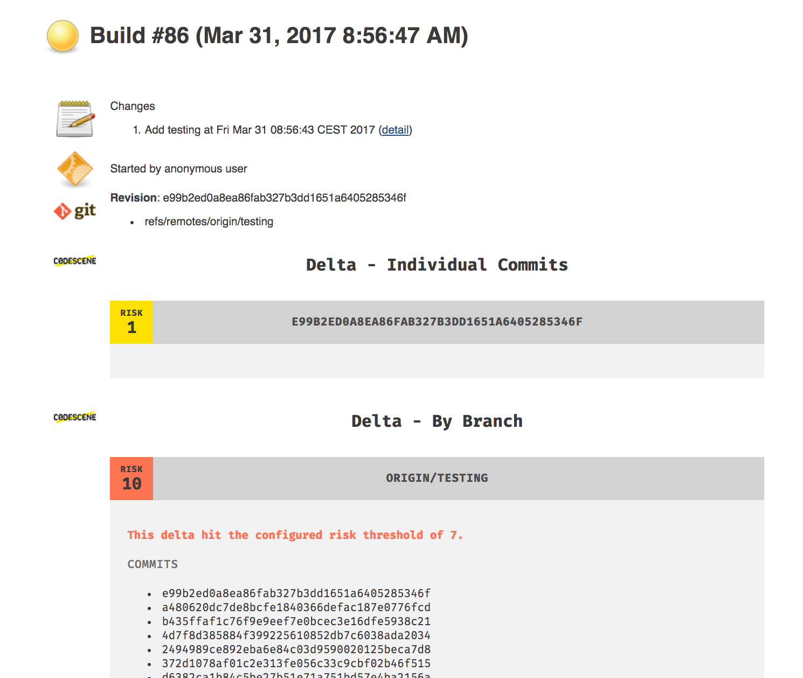
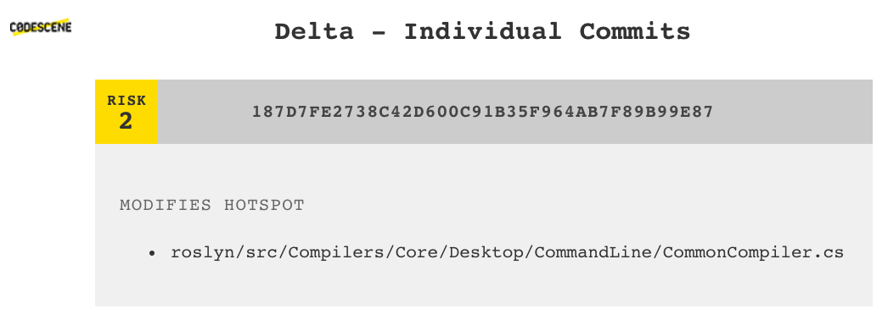
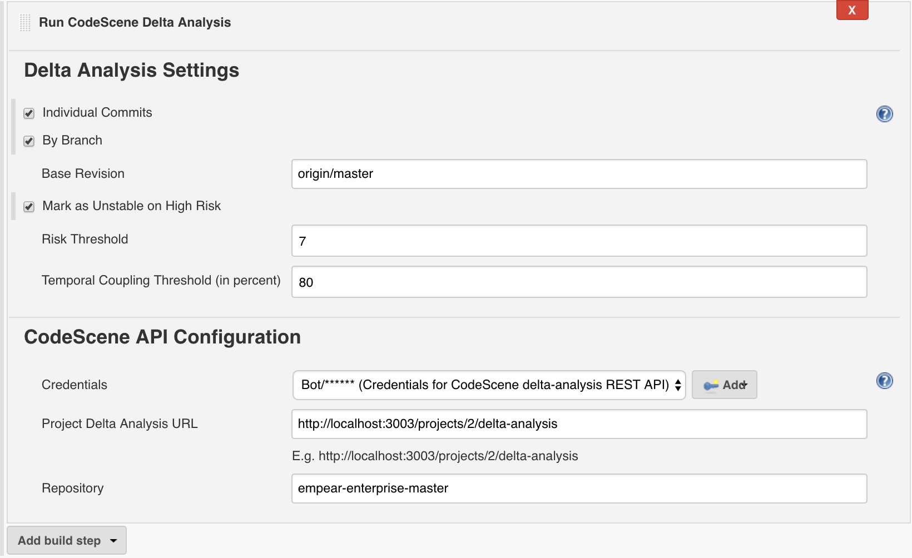

# codescene-jenkins-plugin

A jenkins plugin for
[CodeScene](http://www.empear.com/products/codescene-on-premise/) by Empear.

CodeScene detects potential maintenance problems and early warnings in your
codebase. The earlier you can react to those findings, the better. That’s why
CodeScene offers integration points that let you incorporate the analysis
results into your build pipeline.

This plugin lets you use CodeScene’s Delta Analysis to catch potential problems
before they are delivered to your main branch.

In addition to the risk classification, CodeScene also runs its set of early warning analyses
as shown in the following figure:

The early warnings and risk classification let you prioritize your code reviews and
focus your time where (and when) it’s likely to be needed the most.
Code reviewer fatique is a real thing, so let’s use our review efforts wisely.

## Installation

This plugin can be downloaded as an `.hpi` file from one the [published
releases](https://github.com/empear-analytics/codescene-jenkins-plugin/releases). Then,
in the Jenkins configuration UI for plugins, upload the `.hpi` file to install
it.

### Configure Jenkins for CodeScene

Enable the CodeScene integration by adding a new build step in your Jenkins configuration. Select the option *Run CodeScene Delta Analysis*.

Enter the required information in the CodeScene Jenkins configuration as show in the following figure:

CodeScene gives you a number of options that controls the scope of the delta analysis:

* *Individual Commits*: Check this option to run a delta analysis on each individual commit. When in doubt, make this your default setting.
* *By Branch*: With this option, CodeScene runs a delta analysis on the difference between the branch you build and the one you provide as reference. Use this option if you want to analyse a whole pull request.

The CodeScene API configuration section has to match the information specified inside CodeScene itself and retrievable from the analysis configuration.

## Changelog

* 1.0.1
  - Add checksums to built artifacts in GitHub releases
* 1.0.0
  - Delta analysis by branch, based on _base revision_
  - Delta analysis by individual commits (new commits not seen in previous jobs)
  - "Mark build as unstable" based on risk threshold

## Contributing

You're encouraged to submit [pull
requests](https://github.com/empear-analytics/codescene-jenkins-plugin/pulls),
and to [propose features and discuss
issues](https://github.com/empear-analytics/codescene-jenkins-plugin/issues).

## License

Licensed under the [MIT License](LICENSE).
